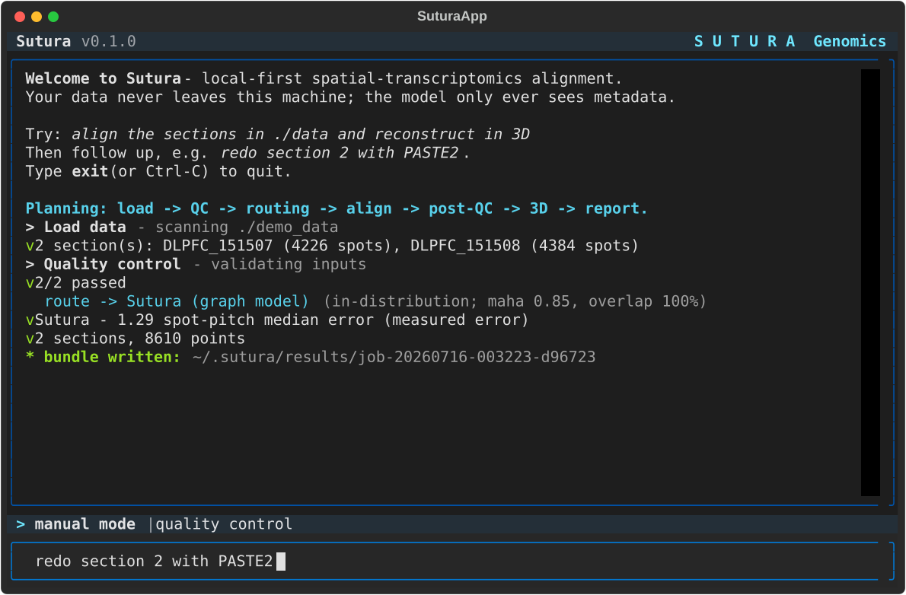

# Sutura CLI (`sutura`)

**Agentic, local-first spatial-transcriptomics alignment — "Claude Code for
spatial data."** You tell `sutura` in natural language what to do with your local
Space Ranger / AnnData files; it runs the full alignment and 3D reconstruction
workflow live in a polished full-screen terminal, entirely on your machine, and
writes a structured **result bundle** that the Sutura viewer app opens.



- **Local-first, no data egress.** Nothing is uploaded. The agent's planner LLM
  only ever sees *metadata* (section names, spot/gene counts, formats) — never raw
  expression. Runs against a **local model via Ollama with no API key**. This is
  what makes it usable on clinical / PHI samples that can't leave the institution.
- **Workflow-native.** Reads real primary-processing output and drives the
  existing Sutura orchestrator: QC → distribution check → routing → alignment →
  post-QC → 3D reconstruction → reporting.
- **Honest by construction.** Every result is labelled with the method that
  produced it and why. Sutura's graph model wins in-distribution; PASTE2 is used
  off-distribution (where auto-adapt is tried and the best kept). This automates
  *best-available* alignment — it does not claim to beat every method on every
  tissue.

This is product #1 (the engine). Product #2, the viewer app, only *reads* the
bundles this CLI writes — it never runs reconstruction. See the
[bundle schema](docs/BUNDLE_SCHEMA.md) and the
[architecture note](docs/ARCHITECTURE.md).

## Install

`sutura` wraps the existing alignment engine in this repository (the research
code under `src/`, the trained checkpoint `results/arca_shared_basis.pt`, and the
frozen shared basis). Install it into the same environment as that engine:

```bash
# from the repository root, using the project venv (Python 3.12)
.venv/Scripts/python.exe -m pip install -e cli
```

This installs the `sutura` entry point. The engine repo is auto-detected from the
install location; override it any time with `SUTURA_REPO=/path/to/repo`.

### Run from any terminal (Windows) — no venv activation

The `pip` entry points live under `.venv\Scripts`, so they only resolve when the
venv is activated. To make `sutura` (and `sutura-app`) launch from **any** new
terminal with zero activation, run the installer once — it drops `.cmd` launchers
on your user PATH that wrap the venv's entry points:

```powershell
powershell -ExecutionPolicy Bypass -File cli\scripts\install-windows.ps1
```

Then open a **new** terminal and just type `sutura`. (Re-runnable; it also adds
the launcher directory to your user PATH if it isn't already there.)

### Local model (no API key)

The planner runs on a local model by default when one is available. Install Ollama
and pull a small instruct model:

```bash
ollama pull llama3.2:3b       # recommended: fast (~3-5s/plan on CPU) and reliable
```

That's it — no key, no network, no data egress. `llama3.2:3b`, `qwen2.5:3b`, and
`gemma3:4b` all plan the core intents correctly; even tiny models are kept honest
by the validator + rule fallback (see below). Real recorded sessions:
[docs/example_sessions.md](docs/example_sessions.md).

## Usage

```bash
sutura                                   # launch the full-screen TUI
sutura -H "align ./data and reconstruct in 3D"   # headless (streams to stdout)
```

### Natural-language commands it understands

Type these at the prompt (TUI) or pass with `-H` (headless). Phrasing is flexible
— the local model interprets intent; the rule planner guarantees the action space.

| You say… | It does |
|----------|---------|
| *"align the sections in ./data and reconstruct in 3D"* | full workflow: load → QC → route → align each pair → post-QC → 3D → report |
| *"stack my slices into a 3D model"* | same (path optional if already loaded) |
| *"redo section 2 with PASTE2"* | re-run that pair with a forced method |
| *"switch section 1 back to the graph model"* | re-run forcing Sutura |
| *"how well did it align?"* / *"show the metrics"* | per-pair method + score |
| *"which section aligned worst?"* | best/worst pair by measured error |
| *"explain the routing decision"* / *"why PASTE2?"* | why each method was chosen |
| *"regenerate the report"* | rewrite `report.md` |
| *"what can you do?"* | a short help reply |

Follow-ups operate on the current job; the read-only queries never re-run
alignment.

### LLM backend selection

`--backend` (or `$SUTURA_BACKEND`): `auto` (default — cloud → ollama → rule),
`ollama` (local, best for PHI), `cloud` (Anthropic, needs `ANTHROPIC_API_KEY`),
`rule` (offline, deterministic; also the safety net for weak local models).

Other env vars: `SUTURA_HOME` (result store, default `~/.sutura`), `SUTURA_REPO`
(engine repo), `SUTURA_OLLAMA_MODEL`, `OLLAMA_HOST`, `SUTURA_CLOUD_MODEL`.

## Demo transcript

```text
╭──────────────────────────────────────────────────────────────────────╮
│  ● SUTURA GENOMICS                                                     │
│  local-first spatial-transcriptomics alignment  ·  v0.1.0             │
│  backend: ollama (llama3.2:3b)  ·  store: ~/.sutura  ·  no data egress │
╰──────────────────────────────────────────────────────────────────────╯
▸ align the sections in ./demo_data and reconstruct in 3D

  Load data  scanning ./demo_data
  ✓ 2 sections: DLPFC_151507 (4226 spots), DLPFC_151508 (4384 spots)
  Quality control
  ✓ 2/2 passed
  Routing  DLPFC_151507 → DLPFC_151508
      → Sutura (graph model)   in-distribution · Mahalanobis 0.85 · gene overlap 100%
  Align  DLPFC_151507 → DLPFC_151508
      · aligning with Sutura graph model … 45%
  ✓ Sutura - 1.29 spot-pitch median error (measured)
  Post-alignment QC
  ✓ pass · median error 1.29 spot-pitch
  3D reconstruction
  ✓ 2 sections, 8610 points
  Generate report
  ✓ report.md (34 lines)
╭─ ✓ Run complete   job-20260716-021415-cbb5e8 ────────────────────────────╮
│  sections 2   pairs 1   3D points 8610                                    │
│                                                                           │
│  Pair                          Method   Result                QC          │
│  ────────────────────────────────────────────────────────────────        │
│  DLPFC_151507 → DLPFC_151508   Sutura   1.29 spot-pitch err   pass        │
│                                                                           │
│  bundle ~/.sutura/results/job-20260716-021415-cbb5e8                      │
│  ▶ open in the Sutura app to view the 3D model                            │
╰───────────────────────────────────────────────────────────────────────────╯
```

Off-distribution data (e.g. a held-out donor or a different tissue) is routed to
the off-distribution path — auto-adapt is tried and PASTE2 is kept when it wins —
and labelled honestly at every step. A 4-section chain is composed into one
reference frame (pairwise composition, honestly labelled). More real sessions,
including forced-method follow-ups and the local-model planner gallery, in
[docs/example_sessions.md](docs/example_sessions.md).

## Result bundle

Written to `~/.sutura/results/<job_id>/`:

```
metadata.json         manifest + index (written last => bundle is complete)
qc.json               per-section input QC
routing.json          per-pair distribution-check / routing decision
metrics.json          per-pair method used + metric/score (honest labels)
reconstruction.json   3D serial-section point cloud (composition labelled)
report.md             human-readable summary
alignment/pair_00__<ref>__to__<mov>/aligned.h5ad
```

Full field-by-field contract: [docs/BUNDLE_SCHEMA.md](docs/BUNDLE_SCHEMA.md).

## Robustness

Every realistic failure mode yields a helpful message, not a stack trace: missing
paths, wrong `obsm` keys (coordinates are auto-recovered from common alternatives),
empty sections, mismatched gene panels, single-section input, and non-adjacent
sections (flagged). Space Ranger is validated; Xenium is detected and, where no
reader is available, rejected with a clear convert-to-`.h5ad` message. A failing
pair is skipped and logged rather than sinking the whole job.

## Architecture

The CLI is a thin agent + UI layer over the *existing* engine — no alignment logic
is reimplemented. LLM backend → agent loop → tools → engine, with a typed event
stream rendered by the console / TUI / tests. Full write-up (and how to add a new
tool): [docs/ARCHITECTURE.md](docs/ARCHITECTURE.md).

## Tests

```bash
.venv/Scripts/python.exe -m pytest cli/tests -q
```

- `test_units.py` — planner intents, `_finalize` fallback, reconstruction composition, report formatting (no engine).
- `test_loaders.py` — every loader failure mode (no engine).
- `test_llm_ollama.py` — the real local model plans the core intents (skips if no Ollama).
- `test_tui.py` — the Textual app composes and quits.
- `test_e2e.py` — full loop on in- and off-distribution data + a 4-section chain, asserting valid bundles (needs engine + DLPFC; auto-skips otherwise; the engine tests are slow — they run real alignments).
